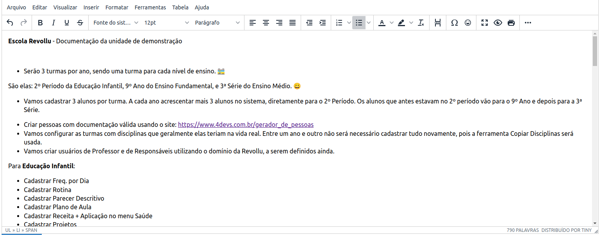
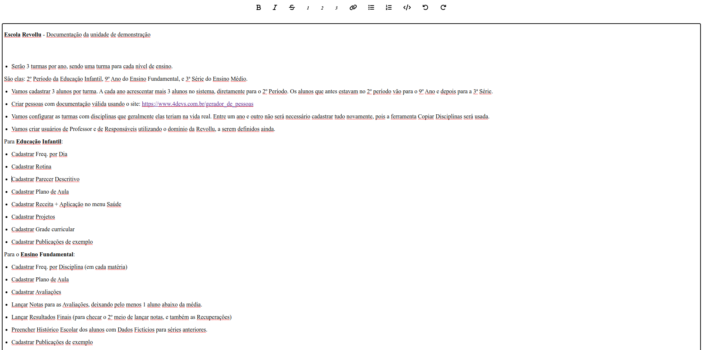

# Design

- TipTap we have to code everything
- TinyMCE is simple as declaring a string

# Responsiveness

- TipTap we have to code everything
- TinyMCE out-of-the-box

# Integration with Vue

- With TipTap we need to use [3rd party components](https://github.com/Leecason/element-tiptap) or create one ourself.

- With TinyMCE we have an [Official Vue Integration](https://github.com/tinymce/tinymce-vue).

# Paste formatted documents (like word etc)

TinyMCE

TipTap

I found this project called [Element TipTap](https://github.com/Leecason/element-tiptap) that wraps everything we need, and tested pasted the same document for a reference. But there's [this bug](https://github.com/Leecason/element-tiptap/issues/170) that prevents us to use FontSize and paste documents without crashing.

Note: TinyMCE has a paid plugin called PowerPaste.

# Autocomplete

- TinyMCE easy to code, with alot of flexibility. Working video:

- TipTap - I already decided for TinyMCE. So I'm not building this anymore.

